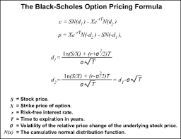

## Introduction
This presentation is part of a project for the course Developing Data Products offered by Johns Hopkins Bloomberg School of Public Health via Coursera.

The shiny application developed will calculate the price of a European Option (Call or Put) based on parameters input by the user.

---

## Definitions
Option is a financial derivative that represents a contract sold by one party (option writer) to another party (option holder). The contract offers the buyer the right, but not the obligation, to buy (call) or sell (put) a security or other financial asset at an agreed-upon price (the strike price) during a certain period of time or on a specific date (exercise date).

'European Option' is an option that can only be exercised at the end of its life, at its maturity.

source: http://www.investopedia.com/

--- .class #id 

## Input

- Option Type: User can select between Call and Put options

- Spot price of the underlying asset 

- Strike price of the underlying asset 

- Time to maturity in years

- Risk-Free Interest Rate (in decimal format)

- Volatility of the underlying asset (in decimal format)

---
## Output

The app will perfrom the below calculations and return the results:

</img>

## Links

You can find the code for the application in github:

https://github.com/jorgebarron/Dev-Data-Products

